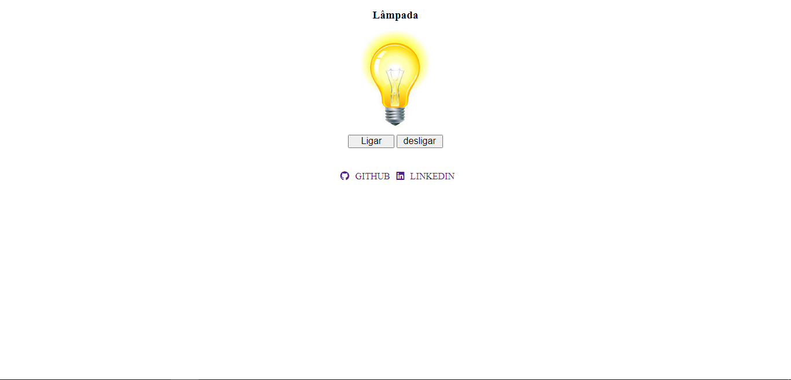

# Projeto simples de lâmapda

Nesse projeto simples, o objetivo é liga, desligar e mostra a lâmpada quebrada, utilizando JavaScript.

## Stack utilizada

**Front-end:** HTML, CCS, JavaScript

## Layout

# Minhas redes socias

[Linkedin](https://www.linkedin.com/in/devamauryjr/)
[GitHub](https://github.com/devamauryjunior)